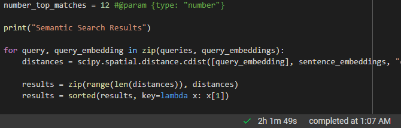
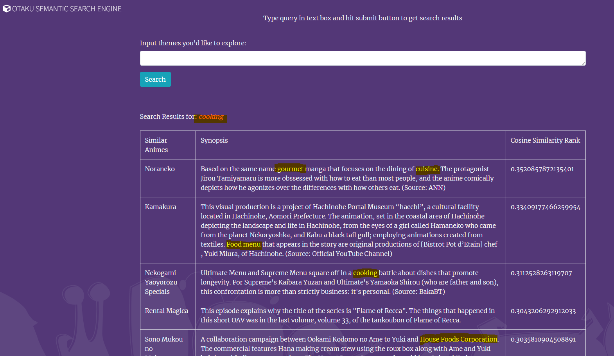

# Project Documentation
## Demo Presentation
The presentation can be found [here](https://youtu.be/xvSqpgANoFU).

## Description

The purpose of this project is to use a pre-trained model based on BERT to
predict the sentiment of a given text.  The embeddings were obtained from encoding with BERT-based sentence models called [Natural Langauge Inference (NLI)](https://github.com/UKPLab/sentence-transformers/blob/master/docs/pretrained-models/nli-models.md) based on work by [Conneau et al., 2017](https://arxiv.org/abs/1705.02364). The model is trained on the [Top 10000 Anime Movies, OVA's and Tv-Shows](https://www.kaggle.com/thomaskonstantin/top-10000-anime-movies-ovas-and-tvshows) dataset.

The web app developed is a semantic search engine that allows users to search for an anime title based on a given search query. The search results are then displayed in a top-5 list of the most similar anime titles. The synopsis and the cosine similarity score is also displayed for each result.

The application uses Sentence BERT (SBERT) instead of regular BERT. Using regular BERT for Semantic Search would be slow. The task in semantic search is to find the most similar sentences in a dataset to a given query. This would mean comparing the query to all sentences in the dataset. For a dataset of 10000, it would take on average more than 40 seconds to retrieve a result. The root cause of this slow down is that BERT needs to process both sentences at once in order measure similarity.

Sentence BERT speeds this up by precomputing the model representations of the sentences. This means that the model only needs to be run once for each sentence. This was the basis of the paper "Sentence-BERT: Sentence Embeddings using Siamese BERT-Networks" by [Reimers N., Gurevych I., et al.](https://arxiv.org/abs/1908.10084) Instead of asking BERT to process the query and all sentences on-demand. We then use the cosine similarity function to rank the most relevant sentences.

The original dataset was cleaned and preprocessed to remove any titles that had synopsis that was less than 140 characters long. The pre-training and inference were completed using the [Sentence Transformers](). The procedure was adapted from devloper [documentation](https://github.com/UKPLab/sentence-transformers/blob/master/docs/pretrained_models.md) covering Semantic Search. The pre-trained model used was [bert-base-nli-mean-tokens](https://huggingface.co/sentence-transformers/bert-base-nli-mean-tokens) from the huggingface library. The [multi-qa-MiniLM-L6-cos-v1](https://huggingface.co/sentence-transformers/multi-qa-MiniLM-L6-cos-v1) pre-trained model was also tested. An obvious barrier to the ranking is that the Anime dataset utilizing Japanese transliterated words. The model itself is trained on an English dataset.

## Usage
There are 3 ways of running the webapp provided:
1. Run the webapp locally on your machine.
2. Run the webapp on a server.
3. Launch the jupyter notebook and run through the steps.

The usage documenation is provided in the next section.

## Implementation Documentation
There are four main files in the source code:
* SearchEnginePrototype.ipynb: The Jupyter Notebook file that can run through the steps of the semantic search without the need to run the webapp.
* build_search_index.py: The python file that builds the search index.
* otaku_semantic_search.py: The python file that runs the webapp.
* cloud_install.sh: The bash script that installs the webapp on a server.

### Building the Semantic Search Index
Source: `<repo-root-dir>/otaku_search_engine/build_search_index.py` 
or `<repo-root-dir>/SearchEnginePrototype.ipynb`

Either using SearchEnginePrototype.ipynb or build_search_index.py is run in order to build the embeddings files. The pre-trained sentence transformers is downloaded from huggingface. It will then check for existing embedding and data files. If the files do not exist it will guide you through the process of downloading the data and cleaning the data. It will then encode the model against the cleaned data and save the embeddings.

```python
from sentence_transformers import SentenceTransformer, util
model = SentenceTransformer('multi-qa-MiniLM-L6-cos-v1')

# Example query
query_embedding = model.encode('Food and knights')

# Embeddings from the pre-trained model are generated here.
sentence_embeddings = model.encode(['Synopsis 1',
									...
                                  'Synopsis n'])

# Similarity scores are calculated here.
print("Similarity:", util.dot_score(query_embedding, passage_embedding))
```
Transformers are trained against a knowledge graph of multiple data sources. These models are then used to encode the data from the dataset generating rich token embeddings using an enormous corpus.

### Training completed on Collab through the Jupyter Notebook:


### Running Queries and Displaying Results
Source: `<repo-root-dir>/otaku_search_engine/otaku_semantic_search.py`

The file starts by importing the necessary libraries. Then it loads the cleaned dataset as well as the embeddings. It then creates a flask app and defines the routes. The flask app loads the webpage based on the template used.

The queries and and embeddings are stored in a 78-parameter vector representation each. The query is passed to the model and the model returns the embedding representation of the query. The embedding is then compared to the embeddings of all the anime synopsises in the dataset. The cosine similarity score is then calculated between the two embeddings. The top 5 results are then displayed.

Displayed are name of the anime, the synopsis, and the cosine similarity score.

### The webapp semantic search results:

Note how the words in the synopsis are not the same as the query word(s).

---
## Usage Documentation

## Step 1 : Install Anaconda

1. Install the [Anaconda distribution](https://www.anaconda.com/products/individual), then open *Anaconda prompt*.

## Using environment.yaml

1. Download the [environment.yaml](https://github.com/jamescalam/transformers/blob/main/environment.yaml) for the course.

2. In *Anaconda prompt*, navigate to the directory containing the *environment.yaml* and write `conda env create -f environment.yaml`.

3. Activate the new environment with `conda activate cs410`.

4. Move onto the **Installation of PyTorch** section.

## Using the minimum requirements
1. If you would like to install the bare minimum, you can follow the following commands:
```
pip install requests
pip install tensorflow
pip install flask
pip install sentence-transformers
pip install scipy
pip install keras
pip install --upgrade pandas
```

1. Or type `pip install -r requirements.txt`

## Installation of PyTorch

1. Open the [PyTorch installation page](https://pytorch.org/get-started/locally/).

2. Select the *CPU* option if you don't have PyTorce already and want to keep it light.

3. Copy the given command and run it in Anaconda prompt.

## Enable GPU 
(**Optional**: only if your are encoding from scratch)

If you have a CUDA enabled GPU, you can take advantage of GPU acceleration. If you already have CUDA installed, skip steps 1-3.

1. Install a NVIDIA GPU driver from [here](https://www.nvidia.com/download/index.aspx?lang=en-us).

2. Install [CUDA toolkit](https://developer.nvidia.com/cuda-toolkit-archive), this course originally used version 11.1 but feel free to use a more recent version that is displayed [here](https://pytorch.org/get-started/locally/) under *CUDA*.

3. Install [cuDNN](https://developer.nvidia.com/cudnn).

4. Confirm installation by writing `nvcc --version` in *Anaconda prompt*, the CUDA version should appear (such as *cuda_11.1*).

5. Once complete, install PyTorch using instructions in **Installation of PyTorch** section above.

## Adding to Jupyter

Once your environment is setup, it can be added as a kernel to Jupyter lab/notebook by:

1. In *Anaconda prompt* write `conda active ml`.

2. Then write `python -m ipykernel install --user --name ml --display-name "ML"`

3. The kernel has been installed, switch back to *base* with `conda activate base` then open Jupyter with `jupyter lab`/`jupyter notebook`.

## Step 2 : Install Dependencies

1. Clone the Repo

2. cd into the repo

## Step 3 : Choose a method to run with
### Option 1 : Run the steps in SearchEnginePrototype.ipynb
I trained the models on Google Collab Pro on a TPU with the high-ram option, this would
take significantly less time than running on a CPU. I have included the embeddings
for this reason so that you can just load the embeddings and run the code.

### Option 2 : Run the flask app by running otaku_semantic_search.py (recommended)
The flask app is a simple web app that can be launched locally.
It will run on port 8080 of your local machine, i.e. http://localhost:8080/index.html

1. Go to directory otaku_search_engine
   
2. Execute build_search_index.py or use SearchEnginePrototype.ipynb to create the embeddings
   
3. python otaku_semantic_search.py
   
4. Navigate to http://localhost:8080/index.html or http://127.0.0.1:8080/index.html

### Option 3 : Start a Deep Learning EC2 instance or equivalent (costly)
Requires Deep Learning AMI (Ubuntu 18.04) Version 53.0 or better. Free tier does not support the installation of large deeplearning libraries.
This app would need to be redone using tensorflow lite and BERT mobile for ec2 free deployment.
Alternatively, the app can be refactored to use a serverless function (amazon lambda) to deploy the model and interact with EC2 free. 
EC2 free in this case would run the webhost. However, this approach will be slower as serverless functions run on-demand.

1. Follow the following commands after starting the server:
```
sudo apt-get install libgl1-mesa-glx libegl1-mesa libxrandr2 libxrandr2 libxss1 libxcursor1 libxcomposite1 libasound2 libxi6 libxtst6
wget https://repo.anaconda.com/archive/Anaconda3-5.0.1-Linux-x86_64.sh
chmod +x Anaconda3-5.0.1-Linux-x86_64.sh
sudo reboot
```

Ensure bashrc is configured to use Anaconda!

2. Install Requirements

```
conda install selenium
sudo apt-get install python3-bs4
sudo apt-get install chromium-chromedriver
pip install --upgrade pandas
pip install requests
pip install flask
```

#### Clone and create the embeddings

1. Clone the repo and `cd <repo-directory>`
   
2. 'pip install -r requirements.txt`
   
3. cd `<repo-directory>/otaku_search_engine/`

4. `python build_search_index.py` (**Optional**: pretrained models are included)

#### Start web server
`nohup python otaku_semantic_search.py &`

# Progress Report
## 1. Which tasks have been completed?
The tasks below are based on my current comprehension of NLP. The path followed will vary based on each individual.
- [x] Setup CUDA via Collab and SSHed in via VS Code. This is my working environment.
- [x] NLP and Transformers
	- Reviewed Word Vectors, RNNs, Long Short-Term Memory, Encoder-Decoder Attention, Self-Attention, Multi-head Attention, Positional Encoding, and Transformer Heads 
	- [[Github] NLP Progress on Sentiment Analysis](https://github.com/sebastianruder/NLP-progress/blob/master/english/sentiment_analysis.md)
	-  [Baselines and Bigrams: Simple, Good Sentiment and Topic Classification Wang and Manning 2012](https://www.aclweb.org/anthology/P12-2018/)
- [x] Preprocessing for NLP
- [x] Attention
	- Went over examples of Dot-Product Attention applications
	- Reviewed self, bidirectional, multihead and scaled dot-product attention models.
	- [Attention Is All You Need Vaswani et al. 2017]( https://arxiv.org/pdf/1706.03762.pdf)
	- [Effective Approaches to Attention-based Neural Machine Translation Luong et al. 2015]( https://www.aclweb.org/anthology/D15-1166/)
- [x] Language Classification
	- Explored prebuilt flair models, looked at tokenization and special tokenization for BERT.
	- [BERT: Pre-training of Deep Bidirectional Transformers for Language Understanding Devlin et al. 2019]( https://arxiv.org/pdf/1810.04805.pdf)
- [x] Building an initial Sentiment Model with TensorFlow and Transformer
	- Used the Kaggle API to download a dataset, built a dataset, shuffled, batched, split, and saved it. 
	- [Revisiting Low-Resource Neural Machine Translation: A Case Study Sennrich and Zhang 2019]( https://www.aclweb.org/anthology/P19-1021.pdf)
## 2. Which tasks are pending?
- [x] Long Text Classification with BERT
- [x] Named Entity Recognition (NER) - spaCy
- [x] Question and Answering - SQuAD
- [x] Understanding the metrics, applying ROUGE to Q&A
- [x] Develop a Reader-Retrieval QA with Haystack
- [x] Create an Open-Domain QA with Haystack
- [x] Pre-Train the transformer model with Masked-Language Modelling
- [x] Setup the Next Sentence Prediction (NSP) Pre-Training Loop and DataLoader
- [x] Review the Sentence Transformer
- [x] Build final web application

## 3. Are you facing any challenges?
I have being going over the notes of Jacob Eisenstein, called [“Natural language Processing”]( https://github.com/jacobeisenstein/gt-nlp-class/blob/master/notes/eisenstein-nlp-notes.pdf). I found this book daunting when I first read through it, however after going through Text Information Systems it’s become a more enjoyable read. New topics are tough to digest, however there is content from Medium through to youtube that provide a quick high-level overview.

I have started processing the data, it is very easy to get into too much detail as there are plenty of interesting papers that delve into alternative approaches.
